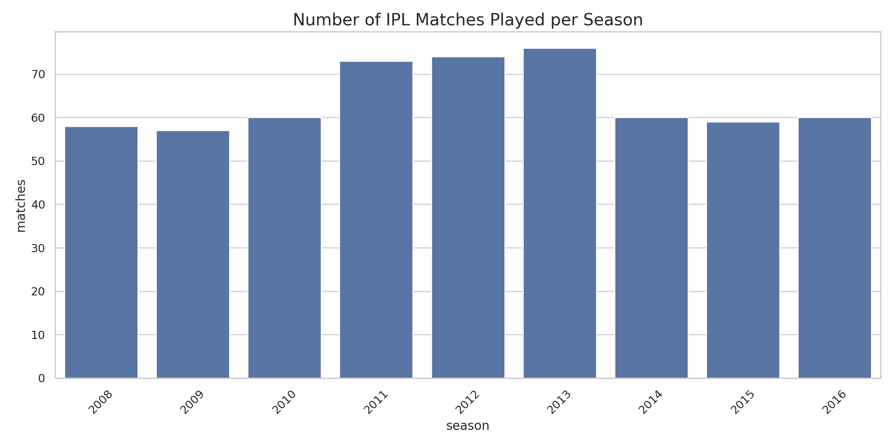
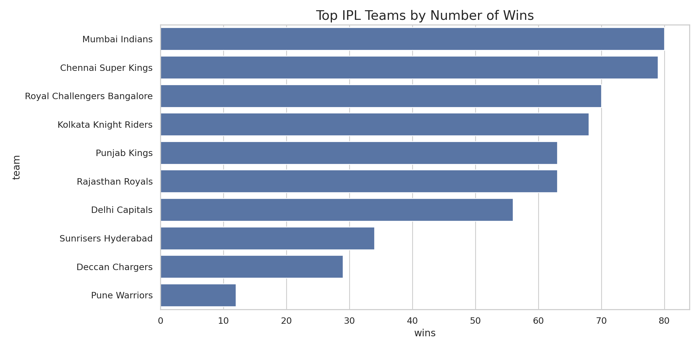
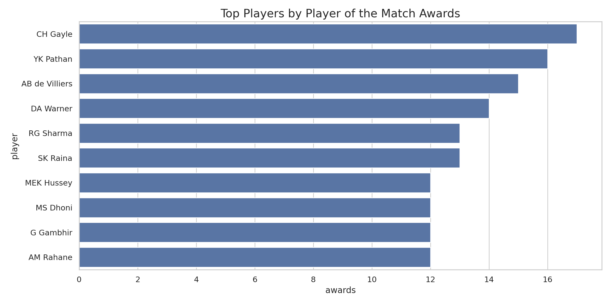
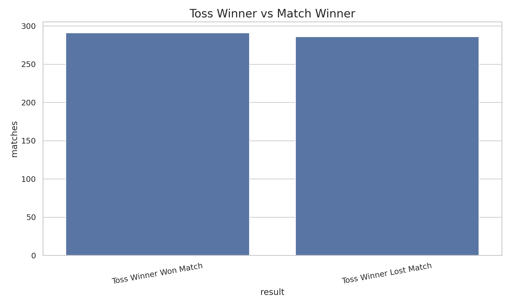
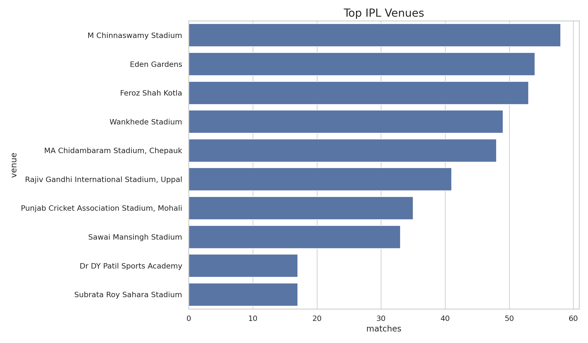

# IPL Sports Dataset Visual Story

## Project Overview

This project presents a data-driven visual analysis of Indian Premier League (IPL) cricket match data using Python.

The objective is to transform raw sports data into meaningful visual insights through data cleaning, exploratory data analysis, statistical summaries, and data visualization.

The project was developed as part of the Minor Project 2 - Artificial Intelligence assignment, which requires working with a real sports dataset, handling missing and inconsistent data, creating meaningful visualizations, identifying player and team performance trends, and presenting the findings through a visual storytelling dashboard and PDF report.

## Project Objectives

The main objectives of this project are:

- Load and analyze a publicly available IPL dataset.
- Understand the structure and characteristics of the dataset.
- Identify and handle missing values.
- Identify and remove duplicate records.
- Standardize inconsistent team names.
- Perform exploratory data analysis.
- Analyze team performance.
- Analyze individual player performance.
- Analyze toss decisions and their relationship with match outcomes.
- Analyze winning margins.
- Analyze venue-level match distribution.
- Identify season-wise performance trends.
- Create meaningful data visualizations.
- Develop an interactive visualization dashboard.
- Generate a PDF insight report containing charts and findings.

## Technologies Used

| Technology | Purpose |
|---|---|
| Python | Data analysis and programming |
| Pandas | Data loading, cleaning and manipulation |
| NumPy | Numerical operations |
| Matplotlib | Data visualization |
| Seaborn | Statistical visualization |
| Plotly | Interactive dashboard |
| ReportLab | PDF report generation |
| Google Colab | Development and execution environment |
| GitHub | Project version control and hosting |

## Dataset

The project uses a publicly available IPL match dataset.

The dataset contains match-level information including fields related to:

- Season
- Match date
- Teams
- Venue
- City
- Toss winner
- Toss decision
- Match winner
- Winning margin
- Player of the Match
- Umpires

The dataset is downloaded programmatically by the notebook, so the raw dataset does not need to be stored in this repository.

## Data Cleaning

The following preprocessing operations are performed:

### Missing Value Handling

Missing values are identified using Pandas and analyzed according to their respective columns.

Categorical fields are handled using appropriate placeholder values, while numerical fields such as winning margins are treated appropriately for analysis.

### Duplicate Removal

Duplicate records are identified and removed to prevent repeated matches from affecting the analysis.

### Inconsistent Data Handling

Historical IPL team names have changed over time. The project standardizes selected team names so that the same franchise can be analyzed consistently across seasons.

Examples include:

- Delhi Daredevils → Delhi Capitals
- Kings XI Punjab → Punjab Kings
- Rising Pune Supergiant → Rising Pune Supergiants

### Date Processing

Match date fields are converted into appropriate datetime formats to support temporal analysis.

## Visual Analysis

The project contains multiple visualizations that communicate different aspects of IPL performance.

### 1. Number of IPL Matches Played per Season

This visualization shows how the number of IPL matches has varied across different seasons.



**Insight:** The number of matches varies between IPL seasons because of changes in tournament structure, participating teams, and scheduling.

---

### 2. Top IPL Teams by Number of Wins

This chart identifies teams with the highest number of match victories.



**Insight:** Teams with a high number of victories demonstrate strong overall performance across the matches included in the dataset.

---

### 3. Top Players by Player of the Match Awards

This visualization identifies players who have received the highest number of Player of the Match awards.



**Insight:** A high number of Player of the Match awards indicates repeated individual contributions that have had a significant impact on match outcomes.

---

### 4. Toss Winner vs Match Winner

This visualization investigates whether the team winning the toss also won the corresponding match.



**Insight:** Winning the toss can provide a strategic advantage, but the toss result does not guarantee match victory.

---

### 5. Top IPL Venues

This visualization shows the venues that have hosted the largest number of IPL matches.



**Insight:** A relatively small number of major cricket stadiums account for a significant proportion of the matches in the dataset.

## Additional Analysis

In addition to the main visualizations, the project performs the following analyses:

- IPL matches by season
- Team win statistics
- Team win percentage
- Player of the Match statistics
- Toss decision analysis
- Toss winner versus match winner analysis
- Winning margin distribution
- Venue-wise match distribution
- Season-wise team performance
- Top-performing teams
- Top-performing players

## Dashboard

An interactive dashboard has been developed using Plotly.

The dashboard provides interactive visualizations for:

- Matches per season
- Team wins
- Player performance
- Toss analysis
- Venue statistics

The dashboard is available in:

`dashboard/IPL_Visual_Story_Dashboard.html`

To view the dashboard, download the HTML file and open it in a modern web browser.

## PDF Insight Report

A PDF report has also been generated containing:

- Project overview
- Dataset summary
- Data analysis
- Visualization results
- Chart-based insights
- Team performance analysis
- Player performance analysis
- Toss analysis
- Venue analysis
- Overall conclusion

The report is available at:

`report/IPL_Sports_Dataset_Visual_Story_Report.pdf`

## Repository Structure

```text
IPL-Sports-Dataset-Visual-Story/
│
├── README.md
├── IPL_Sports_Dataset_Visual_Story.ipynb
├── requirements.txt
│
├── charts/
│   ├── matches_per_season.png
│   ├── team_wins.png
│   ├── top_players.png
│   ├── toss_analysis.png
│   └── top_venues.png
│
├── dashboard/
│   └── IPL_Visual_Story_Dashboard.html
│
├── report/
    └── IPL_Sports_Dataset_Visual_Story_Report.pdf

